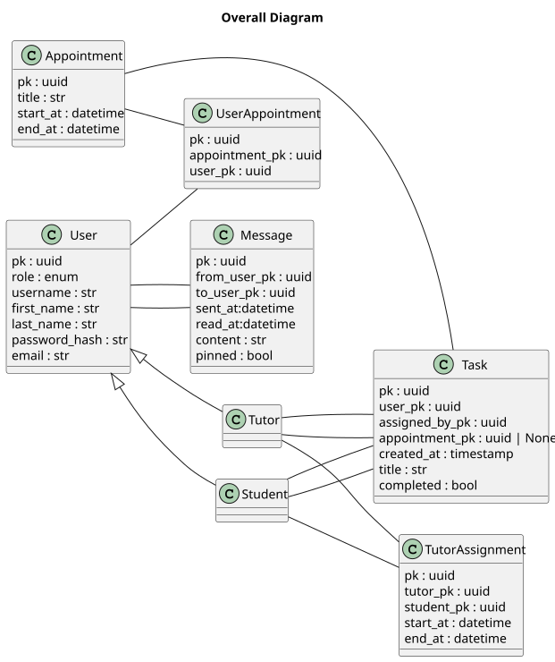
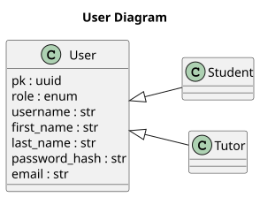
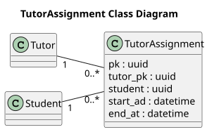
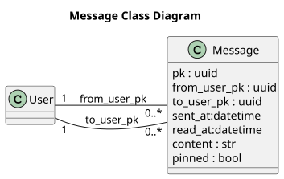
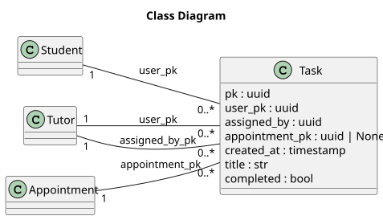
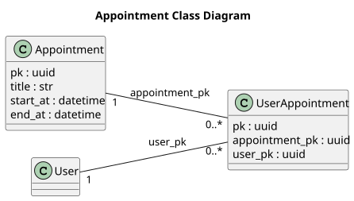

# Diagrammes de classes:

## Synthèse des entités et liaisons

Représente l'ensemble des entités et des liaisons entre elles. Les cardinalités sont explicitées dans les diagrammes spécialisés par entités.

## Utilisateur

Représente l'entité **Utilisateur** et ses spécialisations **Tuteur** et **Elève**

## Tutorat

Représente la relation de **tutorat** entre un **Elève** et son **Tuteur**. Bien qu'un élève ait normalement un seul tuteur, cette relation intermédiaire permet de retracer l'historique des tuteurs assignés à l'élève.

## Message

Représente l’entité **Message** et ses relations avec l’**Utilisateur** en tant qu’expéditeur et destinataire.

## Tâche

Représente la relation entre l'entité **Utilisateur** et **Tâche**, qu'elle soit **personnelle** ou **assignée** par un tuteur. Une tâche personnelle est assignée par l'utilisateur créant la tâche.

## Rendez-vous

Représente la relation entre l'entité **Rendez-vous** et **Utilisateur**. Dans le périmètre initial, le rendez-vous est entre deux parties, l'élève et son tuteur.
