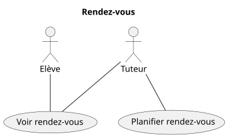

# Domaine : Rendez-vous

## Gestion des rendez-vous



## Fonctionnalité: Planifier un rendez-vous

```gherkin

    En tant que tuteur
    Je veux planifier un rendez-vous avec un élève que j'accompagne
    Afin de faire le point sur ses devoirs et l'avancement de ses tâches

    Scénario: Planification d'un rendez-vous avec des données valides
        Etant donné que je suis sur le formulaire de planification de rendez-vous
        Et que j'ai choisi un destinataire
        Et que j'ai complété les champs obligatoires
        Lorsque je valide le formulaire
        Alors le rendez-vous est créé
        Et le rendez-vous est visible dans le calendrier

    Scénario: Refus de planification d'un rendez-vous sans destinataire
        Etant donné que je suis sur le formulaire de planification de rendez-vous
        Et que j'ai complété les champs obligatoires
        Mais que je n'ai pas choisi de destinataire
        Lorsque je valide le formulaire
        Alors le rendez-vous n'est pas créé
        Et le champ destinataire est mis en valeur
        Et je suis invité à choisir un destinataire

    Scénario: Refus de planification d'un rendez-vous avec une date antérieure à la date courante
        Etant donné que je suis sur le formulaire de planification de rendez-vous
        Et que j'ai choisi un destinataire
        Et que j'ai complété les champs obligatoires
        Mais que la date est antérieure à la date courante
        Lorsque je valide le formulaire
        Alors le rendez-vous n'est pas créé
        Et le champ date est mis en valeur
        Et je suis invité à spécifier une date postérieure à la date courante

    Scénario: Refus de planification d'un rendez avec un créneau horaire déjà pris
        Etant donné que je suis sur e formulaire de planification de rendez-vous
        Et que j'ai choisi un destinataire
        Et que j'ai complété les champs obligatoires
        Mais que j'ai déjà un rendez-vous avec un autre élève sur cette plage horaire
        Lorsque je valide le formulaire
        Alors le rendez-vous n'est pas créé
        Et le champ date est mis en valeur
        Et je suis prévenu que j'ai déjà un rendez-vous prévu sur cette plage horaire

```

## Fonctionnalité: Modifier un rendez-vous

## Fonctionnalité: Consulter ses rendez-vous

```gherkin

    En tant qu'utilisateur connecté
    Je veux voir tous mes rendez-vous dans un calendrier
    Afin de ne pas les oublier, me préparer et m'organiser

    Règles:
        - Seules les rendez-vous de l'utilisateur connecté sont visibles

    Scénario: Consultation de mes rendez-vous dans le calendrier
        Etant donné que j'ai 5 rendez-vous planifiés à venir ce mois-ci
        Et que j'ai 2 rendez-vous passés ce mois-ci
        Lorsque je consulte le calendrier
        Alors mes 7 rendez-vous du mois sont affichés dans le calendrier à leur date
        Et ceux à venir sont mis en valeur

        
    Scénario: Consultation de mes rendez-vous avec absence de rendez-vous planifiés
        Etant donné que je n'ai aucun rendez-vous planifié ce mois-ci
        Lorsque je consulte le calendrier
        Alors aucun rendez-vous n'est affiché
        Et un message me prévient que je n'ai aucun rendez-vous planifié

```

## Fonctionnalité: Consulter le détail d'un rendez-vous