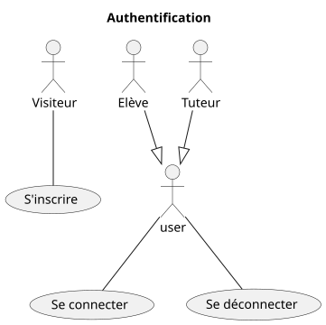
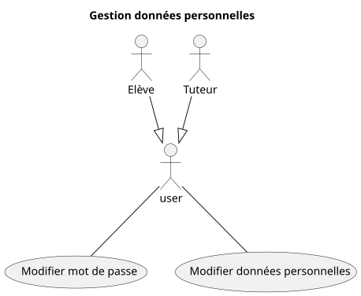

# Domaine : Compte utilisateur

## Gestion de l'authentification



## Gestion des données personnelles



## Fonctionnalité: M'inscrire

```gherkin

    En tant que visiteur
    Je veux créer un nouveau compte
    Afin d'accéder aux fonctionnalités du site

    Scénario: Inscription avec des données valides

        Etant donné que je suis sur le formulaire d'inscription
        Et que je ne possède pas déjà un compte
        Et que j'ai renseigné tous les champs obligatoires avec des données valides
     
        Lorsque je valide le formulaire
        
        Alors l'inscription est validée
        Et mon compte est créé
        Et je suis invité à me connecter

    Scénario: Refus avec des données obligatoires manquantes

        Etant donné que je suis sur le formulaire d'inscription
        Mais que j'ai partiellement renseigné les champs obligatoires avec des données valides
     
        Lorsque je valide le formulaire      
        
        Alors l'inscription est refusée
        Et les données manquantes sont mises en valeur
        Et je suis invité à compléter les données manquantes

    Scénario: Refus avec des données au mauvais format

        Etant donné que je suis sur le formulaire d'inscription
        
        Lorsque je saisis des données dans un format invalide
        
        Alors le formulaire met la donnée en valeur
        Et le format attendu m'est spécifié

    Scénario: Refus avec une adresse email déjà existante

        Etant donné que je suis sur le formulaire d'inscription
        Et que j'ai renseigné tous les champs obligatoires avec des données valides
        Mais qu'un compte avec la même adresse email existe déjà
        
        Lorsque je valide le formulaire complété
        
        Alors l'inscription est refusée
        Et je suis informé que l'adresse email est déjà utilisée
        Et je suis invité à me connecter au lieu de créer un nouveau compte
```

## Fonctionnalité: Me connecter à mon espace personnel

```gherkin

    En tant qu'utilisateur déconnecté
    Je veux me connecter à mon espace personnel
    Afin d'accéder à mon espace personnel
    Et aux fonctionnalités du site

    Scénario: Connexion avec des identifiants valides

        Etant donné que je suis sur la page de connexion
        Et que j'ai complété le formulaire de connexion
        Et que mon adresse email et mot de passe sont valides

        Lorsque je valide le formulaire de connexion

        Alors la connexion est autorisée
        Et j'accède à mon espace personnel

    Scénario: Refus avec identifiants invalides

        Etant donné que je suis sur la page de connexion
        Et que j'ai complété le formulaire de connexion
        Mais que mon adresse email et / ou mot de passe sont invalides

        Lorsque je valide le formulaire de connexion
        
        Alors la connexion est refusée
        Et je suis informé que mes identifiants sont invalides
        Et je suis invité à réessayer

    Scénario: Refus avec des identifiants incomplets

        Etant donné que je suis sur la page de connexion
        Mais que j'ai partiellement complété le formulaire de connexion

        Lorsque je valide le formulaire de connexion
        
        Alors la connexion est refusée
        Et je suis informé que le champ manquant est obligatoire
```

## Fonctionnalité: Me déconnecter de mon espace personnel

```gherkin

    En tant qu'utilisateur connecté à mon espace personnel
    Je veux me déconnecter
    Afin de mettre fin à ma session

    Scénario: Déconnexion

        Etant donné que je suis connecté à mon espace personnel

        Lorsque je clique sur "déconnecter"
        
        Alors je suis déconnecté
        Et un message confirme la déconnexion
        Et je n'ai plus accès à mon espace personnel
```

## Fonctionnalité: Mettre à jour mon mot de passe

```gherkin

    En tant qu'utilisateur connecté à mon espace personnel
    Je veux mettre à jour mon mot de passe
    Afin de le renouveler par sécurité

    Scénario: Modification de mot de passe

        Etant donné que j'ai ouvert le formulaire de modification de mot de passe
        Et que j'ai saisi le nouveau mot de passe
        Et que j'ai confirmé le nouveau mot de passe
        Et que j'ai saisi mon mot de passe actuel

        Lorsque je valide le formulaire

        Alors le mot de passe est mis à jour
        Et un message m'informe que le mot de passe est mis à jour
        Et je suis déconnecté
        Et je suis invité à me reconnecter

    Scénario: Refus lorsque le mot de passe actuel est incorrect

        Etant donné que j'ai ouvert le formulaire de modification de mot de passe
        Et que j'ai saisi le nouveau mot de passe 
        Et que j'ai confirmé le nouveau mot de passe 
        Mais que j'ai saisi un mot de passe actuel incorrect

        Lorsque je valide le formulaire

        Alors le mot de passe n'est pas mis à jour
        Et je suis informé que le mot de passe actuel est incorrect

    Scénario: Refus lorsque le mot de passe actuel est manquant

        Etant donné que j'ai ouvert le formulaire de modification de mot de passe
        Et que j'ai saisi le nouveau mot de passe 
        Et que j'ai confirmé le nouveau mot de passe
        Mais que je n'ai pas saisi le mot de passe actuel dans le champ requis

        Lorsque je valide le formulaire

        Alors le mot de passe n'est pas mis à jour
        Et je suis informé que ce champ est obligatoire

    Scénario: Refus lorsque le nouveau mot de passe ne correspond pas avec la confirmation

        Etant donné que j'ai ouvert le formulaire de modification de mot de passe
        Et que j'ai saisi mon mot de passe actuel
        Et que j'ai saisi le nouveau mot de passe "test_mdp"
        Mais que j'ai confirmé le nouveau mot de passe "test_mdpppp"

        Lorsque je valide le formulaire

        Alors le mot de passe n'est pas mis à jour
        Et je suis informé que le nouveau mot de passe ne correspond pas avec la confirmation

    Scénario: Refus lorsque la confirmation de mot de passe est manquante

        Etant donné que j'ai ouvert le formulaire de modification de mot de passe
        Et que j'ai saisi mon mot de passe actuel
        Et que j'ai saisi le nouveau mot de passe
        Mais que je n'ai pas confirmé le nouveau mot de passe

        Lorsque je valide le formulaire

        Alors le mot de passe n'est pas mis à jour
        Et je suis informé qu'il faut confirmer le nouveau mot de passe
```

## Fonctionnalité: Mettre à jour mes données personnelles

```gherkin

    En tant qu'utilisateur connecté à mon espace personnel
    Je veux modifier mes données personnelles
    Afin de refléter les changements de mes coordonnées

    Scénario: Mettre à jour mes données personnelles avec des données valides

        Etant donné que je suis sur le formulaire de mes données personnelles
        Et que j'ai saisi des données à modifier avec des données sont valides
        
        Lorsque je valide le formulaire
        
        Alors les données sont modifiées
        Et j'ai un message de confirmation
        Et je suis redirigé vers mes données personnelles

    Scénario: Refus lorsque l'adresse email est invalide

        Etant donné que je suis sur le formulaire de mes données personnelles
        Et que j'ai saisi une nouvelle adresse email
        Mais que le format de l'adresse est invalide
        
        Lorsque je valide le formulaire
        
        Alors les données ne sont pas modifiées
        Et je suis informé que le format de l'adresse n'est pas valide
```

## Fonctionnalité: Réinitialiser mon mot de passe

```gherkin

    En tant qu'utilisateur déconnecté de mon espace personnel
    Je veux réinitialiser le mot de passe que j'ai oublié
    Afin de pouvoir en définir un nouveau, pour me connecter à mon espace personnel

    Scénario: Réinitialiser mon mot de passe avec une adresse valide

        Etant donné que j'ai oublié mon mot de passe
        Et que je rempli le formulaire de réinitialisation
        Et que j'ai saisi mon adresse email, valide

        Lorsque je suis valide le formulaire

        Alors je reçois un email avec un nouveau mot de passe
        Et je suis invité à me reconnecter avec

    Scénario: Refus de réinitialiser mon mot de passe une avec adresse invalide

        Etant donné que j'ai oublié mon mot de passe
        Et que j'ai rempli le formulaire de réinitialisation
        Mais que j'ai saisi une adresse email invalide

        Lorsque je valide le formulaire

        Alors le formulaire met en valeur l'adresse email invalide
        Et le format attendu m'est spécifié

```