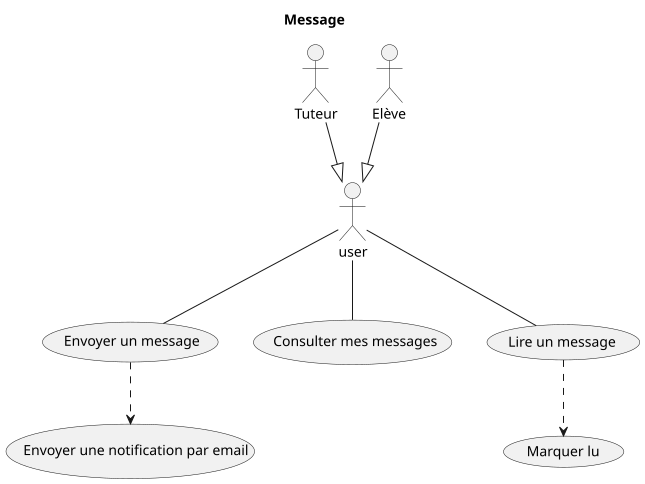
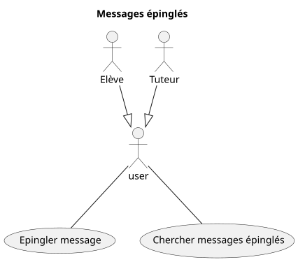

# Domaine : Communication

## Envoi / Lecture de messages



## Epingler et rechercher des messages



## Fonctionnalité: Envoi d'un message à un autre utilisateur

```gherkin

    En tant qu'utilisateur connecté
    Je veux envoyer un message à un autre utilisateur
    Afin de communiquer avec un autre utilisateur

    Scénario: Envoi d'un message à un autre utilisateur
        Etant donné que je suis connecté
        Et que j'ai cliqué sur nouveau message
        Et que j'ai écrit un message
        Et que j'ai renseigné un destinataire existant

        Lorsque je clique sur envoyer

        Alors le message est envoyé au destinataire
        Et le message est marqué non lu pour le destinataire
        Et une notification non lue est envoyée au destinataire

    Scénario: Refus d'envoi d'un message à un autre utilisateur inexistant
        Etant donné que je suis connecté
        Et que j'ai cliqué sur nouveau message
        Et que j'ai écrit un message
        Et que j'ai renseigné un destinataire inexistant

        Lorsque je clique sur envoyer

        Alors le message n'est pas envoyé au destinataire
        Et un message m'avertit que le destinataire n'existe pas

    Scénario: Refus d'envoi d'un message vide à un autre utilisateur
        Etant donné que je suis connecté
        Et que j'ai cliqué sur nouveau message
        Et que j'ai renseigné un destinataire inexistant
        Mais que je n'ai pas écrit de message

        Lorsque je clique sur envoyer

        Alors le message n'est pas envoyé au destinataire
        Et un message m'avertit que le message est vide

```
## Fonctionnalité: Lecture d'un message reçu

```gherkin

    En tant qu'utilisateur connecté
    Je veux accéder à mes messages
    Afin d'en lire le contenu

    Scénario: Lecture d'un message reçu
        Etant donné que je suis connecté
        Et que j'ai reçu au moins un message
        Et que j'ai cliqué sur consulter mes messages

        Lorsque je clique sur un message reçu

        Alors je peux lire le contenu du message
        Et je peux voir l'expéditeur
        Et je peux voir l'horodatage de réception
        Et le message est marqué lu

```

## Fonctionnalité: Epingler un message

```gherkin

    En tant qu'utilisateur connecté
    Je veux épingler un message
    Afin de le retrouver plus facilement plus tard.

    Scénario: Epingler un message
        Etant donné que j'ai au moins un message
        Et que je consulte ce message

        Lorsque je clique sur "épingler message"

        Alors le message est marqué comme épinglé
        Et visuellement je vois qu'il est épinglé

        Lorsque je clique sur "messages épinglés"
        Alors je vois que le message que je viens d'épingler est dans la liste

    Scénario: Désépingler un message
        Etant donné que j'ai au moins un message épinglé
        Et que j'ai cliqué sur "messages épinglés"
        Et que je vois un message épinglé
        Et que je consulte de message

        Lorsque je clique sur "Désépingler message"

        Alors le message n'est plus épinglé
        Et visuellement je vois qu'il n'est plus épinglé

        Lorsque que je clique sur "Messages épinglés"

        Alors je vois que le message n'est plus dans la liste

```

## Fonctionnalité: Recherche de messages reçus épinglés

```gherkin

    En tant qu'utilisateur
    Je veux retrouver facilement mes messages reçus épinglés
    Afin de relire des informations jugées importantes

    Scénario: Recherche des messages épinglés existants
        Etant donné que je consulte mes messages reçus
        Et que j'ai 3 messages reçus épinglés

        Lorsque je clique sur "chercher dans épinglés"

        Alors mes 3 messages reçus épinglés sont affichées

    Scénario: Recherche de messages épinglés inexistants
        Etant donné que je consulte mes messages reçus
        Et que je n'ai épinglé aucun message reçu précédemment

        Lorsque que je clique sur "chercher dans épinglés"
        
        Alors aucun message reçu ne s'affichée
        Et un message m'averit que je n'ai aucun message reçu épinglé

```