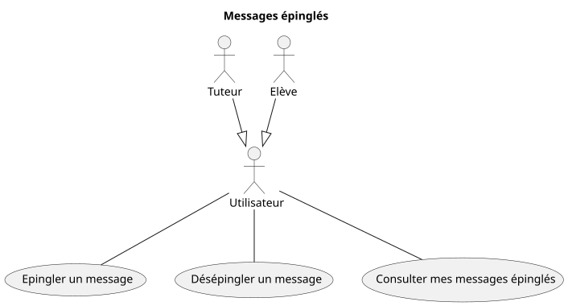

# Domaine : Communication

## Envoi / Lecture de messages


## Epingler et rechercher des messages



## Fonctionnalité: Envoyer un message

```gherkin

    En tant qu'utilisateur connecté à mon espace personnel
    Je veux envoyer un message à un autre utilisateur
    Afin de communiquer avec cet autre utilisateur

    Scénario: Envoyer un message à un autre utilisateur

        Etant donné que j'ai cliqué sur "Nouveau message"
        Et que j'ai écrit un message
        Et que j'ai renseigné un destinataire existant

        Lorsque je clique sur envoyer

        Alors le message est envoyé au destinataire
        Et le message est marqué non lu pour le destinataire
        Et un email de notification est envoyé au destinataire

    Scénario: Refus lorsque le destinataire n'existe pas

        Etant donné que j'ai cliqué sur "Nouveau message"
        Et que j'ai écrit un message
        Et que j'ai renseigné un destinataire inexistant

        Lorsque je clique sur envoyer

        Alors le message n'est pas envoyé au destinataire
        Et un message m'informe que le destinataire n'existe pas

    Scénario: Refus lorsque le message est vide

        Etant donné que j'ai cliqué sur "Nouveau message"
        Et que j'ai renseigné un destinataire existant
        Mais que je n'ai pas écrit de message

        Lorsque je clique sur envoyer

        Alors le message n'est pas envoyé au destinataire
        Et un message m'informe que le message est vide

```
## Fonctionnalité: Consulter mes messages

```gherkin

    En tant qu'utilisateur connecté à mon espace personnel
    Je veux accéder à mes messages
    Afin de consulter les messages reçus

    Scénario: Consulter mes messages

        Etant donné que j'ai reçu au moins un message

        Lorsque je clique sur "consulter mes messages"

        Alors je vois la liste des messages reçus
        Et les messages non lus sont mis en valeur

    Scénario: Consulter mes messages, si aucun reçu

        Etant donné que je n'ai reçu aucun message

        Lorsque je clique sur "consulter mes messages"

        Alors je suis informé que je n'ai aucun message reçu

```
## Fonctionnalité: Lire un message

```gherkin

    En tant qu'utilisateur connecté à mon espace personnel
    Je veux lire un message
    Afin de prendre connaissance du contenu

    Scénario: Lecture d'un message reçu

        Etant donné que j'ai reçu au moins un message
        Et que j'ai cliqué sur consulter mes messages

        Lorsque je clique sur un message reçu

        Alors je peux prendre connaissance du contenu du message
        Et le message est marqué "lu"

```

## Fonctionnalité: Epingler un message

```gherkin

    En tant qu'utilisateur connecté à mon espace personnel
    Je veux épingler un message
    Afin de le retrouver plus facilement plus tard

    Scénario: Epingler un message

        Etant donné que j'ai au moins un message
        Et que je consulte ce message

        Lorsque je clique sur "Epingler le message"

        Alors le message est marqué comme épinglé
        Et le message apparaît épinglé

```

## Fonctionnalité: Désépingler un message

```gherkin

    En tant qu'utilisateur connecté à mon espace personnel
    Je veux désépingler un message que je ne trouve plus utile
    Afin d'avoir une liste pertinente et à jour de messages importants

    Scénario: Désépingler un message

        Etant donné que j'ai au moins un message épinglé
        Et que j'ai cliqué sur "messages épinglés"
        Et que je vois un message épinglé
        Et que je consulte ce message

        Lorsque je clique sur "Désépingler un message"

        Alors le message n'est plus épinglé
        Et le message n'apparaît plus épinglé

```

## Fonctionnalité: Consulter mes messages épinglés

```gherkin

    En tant qu'utilisateur connecté à mon espace personnel
    Je veux consulter mes messages épinglés
    Afin de retrouver facilement un message

    Scénario: Consulter mes messages épinglés

        Etant donné que j'ai au moins un message épinglé

        Lorsque je clique sur "Messages épinglés"

        Alors je vois uniquement les messages épinglés

    Scénario: Consulter sans messages épinglés
    
        Etant donné que je consulte mes messages reçus
        Et que je n'ai épinglé aucun message

        Lorsque je clique sur "Messages épinglés"
        
        Alors je suis informé que je n'ai aucun message épinglé

```

## Hors périmètre initial

### Gestion des contacts
Afin de faciliter la communication entre plusieurs élèves et tuteurs, former des groupes d'entreaide, etc. Une gestion des contacts et des groupes peut être envisagée.