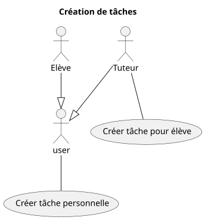
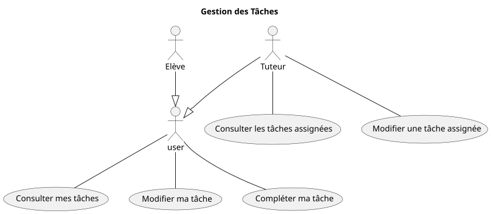

# Domaine : tâches

## Création des tâches



## Gestion des tâches



## Fonctionnalité: Créer une tâche personnelle

```gherkin

    En tant qu'utilisateur connecté
    Je veux créer une tâche personnelle
    Afin de m'organiser
    Ou découper une tâche assignée trop grosse en sous-tâches

    Scénario: Création d'une tâche personnelle avec des données valides
        Etant donné que je suis sur le formulaire de création de tâches
        Et que j'ai complété les champs obligatoires

        Lorsque je valide le formulaire

        Alors la tâche est créée pour moi
        Et la tâche est visible dans mon calendrier

    Scénario: Refus de création d'une tâche personnelle avec des données invalides
        Etant donné que je suis sur le formulaire de création de tâches
        Mais que je n'ai pas complété les champs obligatoires

        Lorsque je valide le formulaire

        Alors la tâche n'est pas créée
        Et les champs obligatoires sont mis en valeur
        Et je suis invité à compléter 

```

## Fonctionnalité: Créer une tâche assignée à un élève

```gherkin

    En tant que tuteur connecté
    Je veux créer une nouvelle tâche à réaliser pour un élève que j'accompagne
    Afin qu'il ait des objectifs à acomplir pour le prochain rendez-vous

    Scénario: Création d'une tâche assignée à un élève avec des données valides
        Etant donné que je suis sur le formulaire de création de tâches
        Et que je suis un tuteur
        Et que j'ai choisi un étudiant
        Et que j'ai complété les champs obligatoires

        Lorsque je valide le formulaire

        Alors la tâche est créée pour l'élève
        Et la tâche est visible dans mon calendrier
        Et la tâche est visible dans le calendrier de l'élève
        Et un email de notification est envoyé à l'élève

    Scénario: Refus de création d'une tâche assignée à un élève avec données obligatoires manquantes
        Etant donné que je suis sur le formulaire de création de tâches
        Et que j'ai choisi un étudiant
        Mais que je n'ai pas complété les données obligatoires

        Lorsque je valide le formulaire

        Alors la tâche n'est pas créée
        Et les champs obligatoires sont mis en valeur
        Et je suis invité à compléter 

```

## Fonctionnalité: Consulter mes tâches

```gherkin

    En tant qu'utilisateur
    Je veux voir toutes mes tâches
    Afin de ne pas oublier d'en compléter

    Scénario: Consultation de mes tâches
        Etant donné que je suis connecté à mon espace personnel
        Et que j'ai 3 tâches assignées par mon tuteur non réalisées
        Et que j'ai 4 tâches personnelles non réalisées
        Et que j'ai 2 tâches personnelles déjà réalisées

        Lorsque je clique sur "consulter mes tâches"

        Alors je suis redirigé vers la page qui liste mes tâches
        Et mes 3 tâches assignées par mon tuteur, non réalisées, sont affichées
        Et sont mises en valeur
        Et mes 4 tâches personnelles, non réalisées, sont affichées
        Et sont mises en valeur différement
        Et mes 2 tâches réalisées sont affichées
        

    Scénario: Consultation de mes tâches avec absence de tâches
        Etant donné que je n'ai aucune tâche

        Lorsque je clique sur "consulter les tâches"

        Alors je suis redirigé vers la page qui liste mes tâches
        Et aucune tâche n'est affichée
        Et un message me prévient que j'ai aucune tâche

```
## Fonctionnalité: Modifier ma tâche

## Fonctionnalité: Compléter ma tâche

```gherkin

    En tant qu'utilisateur connecté
    Je veux marquer "complétée" une tâche
    Afin de m'organiser
    Et ne voir que les tâches restants à faire

    Scénario: Complétion d'une tâche
        Etant donné que je suis sur la tâche sélectionnée
        
        Lorsque que je clique sur "complétée"

        Alors la tâche est marquée comme complétée
        Et la tâche n'est plus visible dans le calendrier

```

## Fonctionnalité: Consulter les tâches assignées

## Fonctionnalité: Modifier une tâche assignée