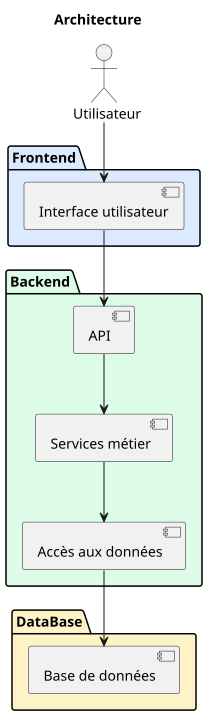

# Specifications

## **Contexte**
HomeSkolar est une association de soutien scolaire d'élèves avec tuteurs bénévoles. Le cout de développement, de maintenance et des licences logicielles doit être en corrélation avec les moyens financiers de l'association.

Le projet va être découpé en plusieurs couches:

## **Frontend**

### UI:
- Affiche l'interface utilisateur
- Permet de consulter, saisir et modifier les données autorisées
- Valide les données au niveau UI pour améliorer l'expérience utilisateur
- Soumet les requêtes HTTP à l'API
- Affiche les réponses de l'API

### Solutions existantes:
- React
- Vue
- Angular
- ...

### Solution retenue:
- React

## **Backend** :

### API:
- Point d'entrée et de sortie du backend
- Reçoit les requêtes http de l'UI
- Vérifie l'authentification de l'utilisateur
- Traduit les requêtes HTTP en données métiers pour les services
- Transforme et valide la structure des données
- Dialogue avec les services métiers
- Traduit les réponses des services en réponses HTTP
- Renvoie les réponses http à l'UI

### Services Métier:
- Reçoit les données de l'API
- Validation des données selon logique métier
- Applique la logique métier
- Dialogue avec les services d'accès aux données
- Renvoie les réponses métier

### Service d'accès aux données: 
- Reçoit les demandes métiers
- Dialogue avec la base de données
- Reçoit les données brutes
- Transforme les données brutes en données métier
- Renvoie les données aux services métiers

### Solutions existantes :
- FastAPI
- Django
- ...

## **Base de données**:
- Reçoit les demandes des services d'accès aux données
- Persiste les données
- Fournit les données
- Renvoie les données brutes

### Solutions existantes:
- Oracle
- SQLServeur
- PostgreSQL
- MySQL
- MarioDB
- ...

## Architecture générale

## Séquence générique de traitement

