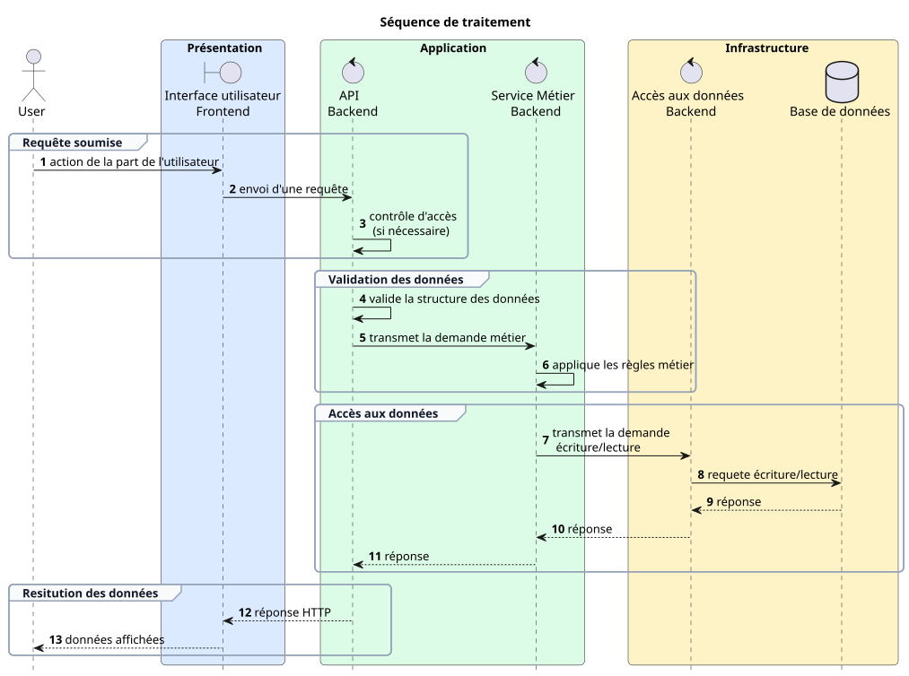

# Choix d'architecturre

Le projet prend la forme d'une application web accessible depuis internet.

L'application est découpée en plusieurs couches, ayant chacune leur responsabilité.

## Contraintes techniques

- Le coût de développement, de maintenance et des licences logicielles doit être en corrélation avec les moyens financiers de l'association.
- Le projet livré sera accessible depuis internet
- Les frameworks, dépendances et librairies utilisés doivent être documentés et maintenus pour faciliter le développement par une petite équipe
- 2 développeurs Frontend
- 2 développeurs Backend

## Contraintes liées aux données

- Le projet manipule des données fortement liées entre elles: relation tuteur-élève, rendez-vous entre deux utilisateurs, etc.
- La solution de persistance doit permettre la relation entre entités et garantir l'intégrité des données

## Contraintes de sécurité générales

- Les frameworks, dépendances et librairies utilisés doivent être maintenus à jour afin de limiter d'éventuelles failles de sécurité
- Le projet est accessible sur internet, par n'importe qui: les fonctionnalités et les données sont protégées par l'authentification.

### Règles de sécurité liées aux comptes utilisateurs

- le mot de passe n'est jamais stocké en clair
- la vérification d'un mot de passe saisi se fait à partir de la valeur sécurisée stockée
- les messages de refus d'authentification affichés par l'UI restent génériques afin de ne pas donner d'indices:
    - sur le mot de passe
    - sur l'adresse email    

## Architecture et séquence

